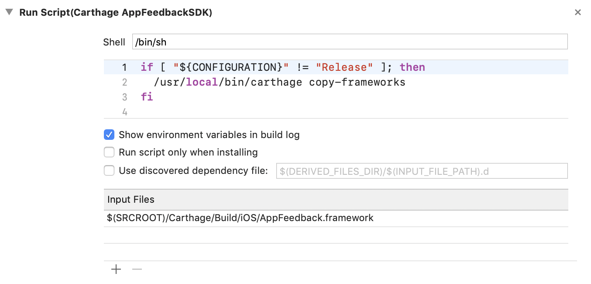

[](https://github.com/Carthage/Carthage)
[](./LICENSE)

[](https://travis-ci.org/yahoojapan/AppFeedback)


# AppFeedback
You can post feedback messages and screenshots to Slack from your iOS app!


It is very useful for internal test!

## How to feedback

Introducing this SDK, a floating icon of feedback is displayed. Tapping it, a feedback dialog is displayed.

## Feature

- Show feedback button
- Two fingers long press to show feedback dialog
- Take a screenshot & Record screen

## Requirements

- iOS 9+

## Usage

Swift

### 1. Incorporate SDK with Carthage

[Carthage](https://github.com/Carthage/Carthage)
```
github "https://github.com/yahoojapan/AppFeedback"
```

If you do not want to include SDK framework binaries in your application, please remove it from Copy Frameworks by looking at the configuration for the following.



### 2. import header

import [Bridging Header](https://developer.apple.com/library/content/documentation/Swift/Conceptual/BuildingCocoaApps/MixandMatch.html)
```
#import <AppFeedback/AppFeedback.h>
```

### 3. Flag definition in configuration to enable SDK

**Please control so that it applies only to internal distribution so that it will not be effective in production application**

First define flags in target configuration


### 4.  Describe SDK initialization process to didFinishLaunchingWithOptions

Describe initialization processing of SDK to "Describe SDK initialization process to didFinishLaunchingWithOptionsdidFinishLaunchingWithOptions"

Initialize the SDK when launching the application. Make sure it is enabled only when the flag you set above is defined.

```swift
func application(_ application: UIApplication, didFinishLaunchingWithOptions launchOptions: [UIApplicationLaunchOptionsKey: Any]?) -> Bool {
    // ……
    
    #if ENABLE_APP_FEEDBACK
        AppFeedback.configure(withSlackToken:"<your token>", slackChannel:"<slack channel id>")
    #endif

    // ……
}
```

To hide the feedback icon, please support display with gesture.
```
        AppFeedback.readyFeedbackGesture()     // Display feedback dialog with two fingers long tap
        AppFeedback.readyScreenShot()          // Display feedback dialog when shooting screenshot
```

### 5. Add action to set SDK to Fastfile

Write [setup_app_feedback_sdk](https://github.com/yahoojapan/fastlane-plugin-setup_app_feedback_sdk) in the fastlane build before build_app. Please specify project, scheme, configuration to use for build.

This action writes the slack api token and channel id to your Info.plist.

```ruby
    setup_app_feedback_sdk(
      project: 'MyApp.xcodeproj',
      scheme: 'MyApp',
      configuration: 'AppFeedback',
      slack_api_token: 'your-slack-token', # Preferably configure as ENV['SLACK_API_TOKEN']
      slack_channel: 'your-slack-channel-id'
    )

    build_app(...)
    run_tests(...)
```

### 6. Build with Screwdriver

The SDK is built in the application for internal distribution built with Screwdriver.


## API

### AppFeedback
#### func readyFeedbackGesture()

Display a feedback dialog with two finger long press gestures.

#### func readyScreenShot()

Display a feedback dialog when shooting screenshots.

#### func startRecording()

Start screen recording (movie capture).

#### func endRecording()

End screen recording (movie capture).

#### var isHidden: Bool { get set }


Boolean value as to whether to display the feedback button. Default is true.

*It is always invisible because there is a problem with the display of buttons under iOS 9.

#### func showFeedbackDialog()

Display the feedback dialog immediately.

Please use this method when displaying feedback dialog by custom gesture etc created by yourself.

```swift
func yourLongPressedGesture(sender: UILongPressGestureRecognizer) {
    AppFeedback.showFeedbackDialog()    
}
```

#### func configure(withSlackToken:channel:)

Set your slack token and channel.

#### var feedbackCategories: [String] { get set }

List of feedback categories.

The default is "Bug" "Request" "Question" "Design" "Others".

#### var slackApiUrl: String { get set }

Slack API URL (default: default: https://slack.com/api)
